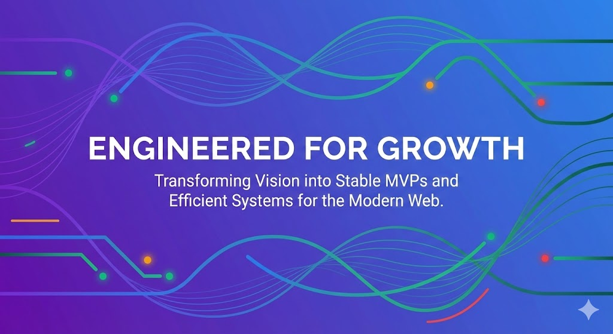

  

<h1 align="center">Hi, I'm Deepak Jha 👋</h1>
<h3 align="center">Principal Architect & Founder @ <a href="https://kosidigital.com" target="_blank">Kosi Digital</a></h3>

  <h2>
    [ 15+ Years of Experience ] 
    Architecting Scalable SaaS for Agencies & Founders.
  </h2>
  

    <em>I don't just build features. I ensure stability, scalability, and production-readiness for complex systems.</em>
  

  
  

---

### 🚀 The Value I Bring (Architectural Level)
With over a decade and a half in the industry, I have moved beyond just coding. I partner with US-based agencies to de-risk their biggest client projects.

* **Proven Longevity:** 15+ years means I’ve seen technologies rise and fall. I choose stacks that last, not just what's hype today.
* **System Stability:** Designing fault-tolerant microservices and event-driven architectures on AWS.
* **Enterprise Frontends:** Structuring large-scale Angular & React applications that don't turn into spaghetti code.

---

### 🛠️ Production-Grade Tech Stack

I focus on the tools that build reliable, scalable businesses.

| Domain | Primary Stack |
| :--- | :--- |
| **Backend Architecture** | **Node.js**, NestJS (for structure), Express, Microservices Patterns |
| **Frontend Engineering** | **Angular** (Enterprise Expert), React, TypeScript, Next.js |
| **Data & Caching** | MongoDB, PostgreSQL, Redis (High-performance caching) |
| **Infrastructure (AWS)** | S3, EC2, Lambda (Serverless), Docker, Kubernetes |

---

  

