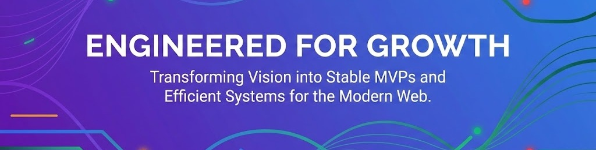

  

div>

<h1 align="center">Hi, I'm Deepak Jha 👋</h1>h1>
<h3 align="center">Principal Solution Architect & Fractional CTO @ <a href="https://kosidigital.com" target="_blank">Kosi Digital</a>a></h3>h3>

  <h2>
        [ 15+ Years of Experience ]span> 
        Building Scalable Backend Systems & AI Solutions for Startups. 
        <em>Systems serving 60M+ monthly active users.</em>em>
  </h2>h2>
  

        <em>I don't just advise — I architect, build, and ship. Production-ready systems that handle real-world scale.</em>em>
  
p>

div>

    a>
    a>
    a>
    a>
    a>
    a>
    a>
    a>

p>

---

### 🚀 The Value I Bring (Architectural Level)

With 15+ years in the industry, I've moved beyond just coding. I architect systems that serve millions of users — from early-stage startups to Fortune 500 teams.

* **System Stability:** Designing fault-tolerant microservices and event-driven architectures on AWS.
* * **AI/LLM Integration:** Building production-ready RAG pipelines, AI agents, and LLM backends.
  * * **Enterprise Frontends:** Structuring large-scale Angular & React applications that scale with the team.
    * * **Fractional CTO:** Strategic technical leadership for teams that need direction, not just developers.
     
      * ---
     
      * ### 🛠️ Production-Grade Tech Stack
     
      * | Domain | Primary Stack |
      * | :--- | :--- |
      * | **Backend Architecture** | **Node.js**, NestJS, Express, Microservices Patterns |
      * | **Frontend Engineering** | **Angular** (Enterprise Expert), React, TypeScript, Next.js |
      * | **Data & Caching** | MongoDB, PostgreSQL, Redis |
      * | **Infrastructure (AWS)** | S3, EC2, Lambda, Docker, Kubernetes |
      * | **AI / LLM** | RAG Pipelines, LangChain, OpenAI, Gemini, LLM Agents |
      * | **DevOps / CI-CD** | GitHub Actions, Terraform, Docker Compose |
     
      * ---
     
      * ### 🏗️ What I'm Building
     
      * | Project | Role | Description |
      * | :--- | :--- | :--- |
      * | [Kosi Digital](https://kosidigital.com) | Founder & Principal Architect | Architect-led engineering firm. Scalable systems, AI integrations, and cloud architecture for global clients. |
      * | [WorkHire](https://workhire.co) | Founder | Enterprise SaaS for bulk hiring across 9+ verticals. AI-powered screening, 48–72 hr time-to-fill. |
      * | MegaExam | Founder | Edtech platform for Indian students — test series, adaptive learning, and study material at scale. |
     
      * ---
     
      * ### ✍️ Where I Write
     
      * * 📝 [LinkedIn Articles](https://www.linkedin.com/in/build-with-deepak/) — Thought leadership on system design, AI, and engineering strategy
        * * 🟦 [Hashnode](https://hashnode.com/@build-with-deepak) — Deep technical dives
          * * 💻 [Dev.to](https://dev.to/build-with-deepak) — Engineering tutorials
            * * 📖 [Medium](https://medium.com/@build-with-deepak) — Architecture essays
             
              * ---
             
              * ### 📫 Get In Touch
             
              * * 🌐 **Website:** [build-with-deepak.com](https://build-with-deepak.com)
                * * 💼 **LinkedIn:** [linkedin.com/in/build-with-deepak](https://www.linkedin.com/in/build-with-deepak/)
                  * * 🐦 **X:** [@DeepakBuilds](https://x.com/DeepakBuilds)
                    * * 📧 **Email:** info@kosidigital.com
  
</em>
  </h2>
